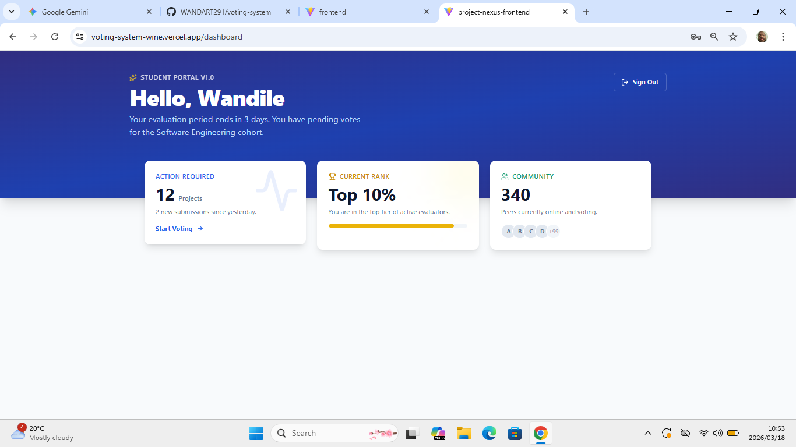
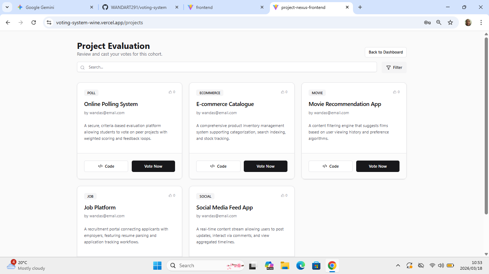
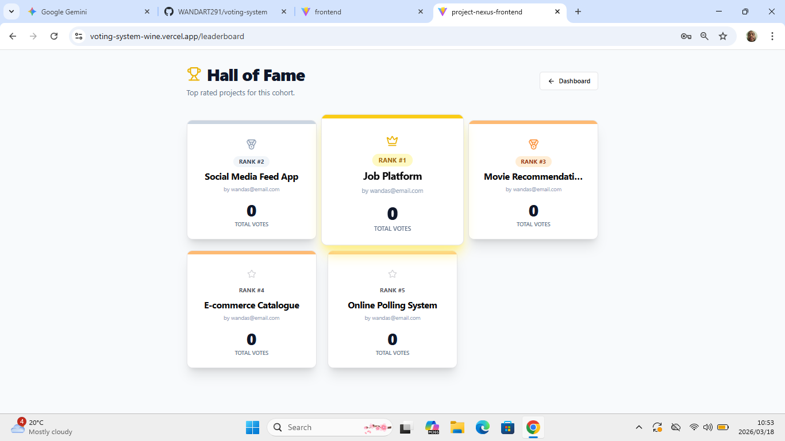

# Project Nexus: Peer Voting System 🗳️

> **A Full-Stack Evaluation Platform for Student Cohorts.**
> *Secure, transparent, and interactive project voting with real-time leaderboards.*

  

🚀 **[View the Live Demo Here](https://voting-system-wine.vercel.app/)**

### Demo Access
To explore the application safely as a guest, use the following credentials:
* **Email:** `demo@test.com`
* **Password:** `Demo123!`

---

## 📸 Platform Interface

### The Dashboard

*Visual analytics showing voting status, rank, and community activity.*

### Project Gallery & Voting

*Interactive project filtering and real-time voting engine.*

### Live Leaderboard

*Dynamic "Hall of Fame" podium ranking the top 3 projects.*

---

## 📌 About the System
The **Peer Voting System** is a production-ready evaluation platform originally designed for ALX students to vote for peer projects. Unlike simple "like" buttons, this system implements a weighted, criteria-based rating system (Innovation, Design, Code Quality) to ensure fair judging.

It features a decoupled architecture with a **Django REST API** managing data/logic and a **React + Tailwind** frontend delivering a modern, responsive user experience.

---

## ✨ Key Features

### 🖥️ Frontend (React & Tailwind)
* **Interactive Dashboard:** Visual analytics showing voting status, rank, and community activity.
* **Live Leaderboard:** Real-time "Hall of Fame" podium ranking the top 3 projects.
* **Smart Search:** Instant filtering of projects by name or category.
* **Responsive Design:** Fully optimized for Mobile, Tablet, and Desktop.

### ⚙️ Backend (Django & Redis)
* **Secure Auth:** JWT-based login/registration (HttpOnly cookies capable).
* **Voting Logic:** Enforces one vote per user per project.
* **Background Tasks:** Celery + Redis handle email notifications asynchronously.
* **Scheduled Jobs:** Celery Beat runs nightly cleanup scripts.

---

## 🛠 Tech Stack

| Domain | Technologies |
| :--- | :--- |
| **Frontend** | React (Vite), Tailwind CSS, shadcn/ui, Framer Motion, Axios |
| **Backend** | Python 3.11, Django 5, Django REST Framework (DRF) |
| **Database** | PostgreSQL (Production), SQLite (Dev) |
| **Async** | Redis, Celery, Celery Beat |
| **DevOps** | Docker, Docker Compose, Gunicorn, Whitenoise |

---

## 📁 Project Structure (Monorepo)

```text
voting-system/
├── backend/               # 🐍 Django API & Logic
│   ├── core/              # Main App (Views, Models, Tests)
│   ├── manage.py
│   ├── build.sh           # Render Deployment Script
│   └── requirements.txt
│
├── frontend/              # ⚛️ React UI
│   ├── src/               # Components & Pages
│   ├── package.json
│   └── vite.config.js
│
└── docker-compose.yaml    # Orchestration

cd backend

# Create & Activate Virtual Env
python -m venv env
source env/Scripts/activate  # (Mac/Linux: source env/bin/activate)

# Install Dependencies
pip install -r requirements.txt

# Run Migrations & Start Server
python manage.py migrate
python manage.py runserver

cd frontend

# Install Dependencies
npm install

# Start React Dev Server
npm run dev

USER 1---∞ RATING ∞---1 PROJECT
          |
          ∞
       CRITERIA

cd backend
python manage.py test core

👤 Author: Wandile Khanyile | Full Stack Software Engineer 